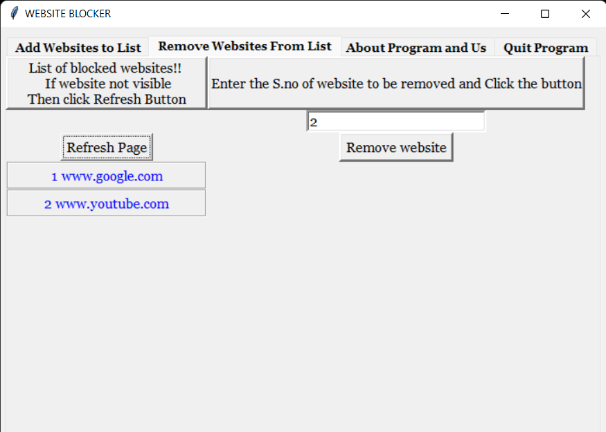

# WebPage Blocker
***
## A Simple Program 


[](https://github.com/Gurneet1928)

This is a python based web blocker that restricts users from accesing particular web pages , made with the help of mySQL in background. 
***
## Features

- Add Webpage -> Add Webpage to the file . This webpage will be blocked for further access.
- Remove Webapge -> Displays the list of all the webpages blocked . User can remove any webpage from that list
- About program and Us -> Displays some info about programmer and program
- Quit Program -> A simple button for exiting the program after all the works.
- It creates a **websitesdb** database that helps to keep the records safe

### Note : Administrator rights are must for the program to __really__ add the website into block list.

Python is an interpreted high-level general-purpose programming language. Its design philosophy emphasizes code readability with its use of significant indentation. Its language constructs as well as its object-oriented approach aim to help programmers write clear, logical code for small and large-scale projects.
***
# Program Images




***
## Python Tech used in this  ::

- Tabs
- Frames
- Messagebox
- Tkinter
- Grid
- MySQL
- File Handling

And a lot more , including **PYTHON** itself.
***
## Pre-Requisites
- **MySQL latest version** --> It can be download from here : https://www.mysql.com/downloads/.
- **Python3**
- **MySQL Drivers/Connectors for Python** --> Follow the Below Steps to Install it using **CMD**
     * Open CMD using administrator
     * Run the following Code as it is :
```python -m pip install mysql-connector-python```
***
## Installation and Configuration of MySQL
Before running the software , make sure that **MySQL** is installed and also the connection driver.
Also , make sure the **MySQL Server** is running . To run it :
- Go to run 
- type : ```services.msc```
- Start a service called ```MySQL```

This software requires python to be installed in the system
No further installation process is requried And it is a ***DOWNLOAD-AND-RUN*** Software
It comes with an .exe file as well for users to run it directly
***
# Run the Software

This software can be run using 3 different ways :
- **Using .exe File** : There is a ````WebBlocker.exe```` file in the folde as well as its shortcut. This makes this program running easier. Just double click on it.
- **Using CMD** : Open CMD in the directory where the program is placed . Then run the following code ```` WebBlocker.py ````
- **Using .py file** : Just double click open on the ```WebBlocker.py``` file in the folder and the program will open. Make sure to run this code as ***administrator**.
- **Using .ipynb file** :  Just open the ```WebBlocker.ipynb``` in softwares such as anaconda to run it in the software itself. Make sure to run ANACONDA as **administrator**
***
# Usage of Tabs
* ### Add Website to list
  - Type the name in the entry box and click the add button. The webiste should be in the format ```www.example.com``` to be accepted . Otherwise it will be rejected
* ### Remove Websites from List
  - Click on **Refresh**  option before using it everytime.
  - Enter the S.no of website in the entry box and click to remove.
  - Click **Refresh** again to refresh the list


## .EXE made with the help of auto-py-to-exe ```https://pypi.org/project/auto-py-to-exe/``` .

***
## License

MIT

**Free Software, Good Job to me :) :)**
***

# FAQ

**Q1)** The program shows a command line in back with things like "(None,) None" or "(1,) 1" . What are these and are these necessary ? <br />
**Ans)** These are just printing the current number of added websites in database and helps to keep a track of it . These are of no use to user if he only intends to use thr program for simple usage. And donot close the command line in any case.

**Q2)** After opening the program , a black screen shows and the program closes itself ?<br />
**Ans)**  This is mainly due to MySQL Server either being not installed or server not started manually by user. Make sure to read the Installation steps carefully.

**Q3)** Since this blocks websites , that means its keeping a track on me and my data . Is my data safe with it ?<br />
**Ans)** In any case, If you are using the original software by the developer, it won't steal any data and infact, this software runs offline as well. All your files are safe and with you. If you want to know more about how it blocks the webiste , ask the chef ( the developer ) for its secret ramen recipe.

**Q4)** I am interested in supporting developer . How can I help him ?<br />
**Ans)** Currently , I ( the developer ) is in no condition to ask or accept any help . But I always appreciate if you share my content and **STAR** it on github . Since , I am in learning stage , I will be making more softwares in future . I mostly like to work solo , so , you won't  be able to help me currently . Anyways , thank you for you support and I would love to answer your questions or help you in your works as well. Thank you !! :))

**Q5)** Is this program still under development ?<br />
**Ans)** The implementation of the program was easy and hence there aren't much the developer can do about its functionality at current time. But it does not mean it is dead or out of development. You can call it completed at this stage. But , If in future , any changes like design or port to other systems or etc is required , I will be back . 


<br />

***
# Thank You for Going through my software and Helping me . Make sure to __STAR__ the project for supporting me . :) :) (～￣▽￣)～ 
