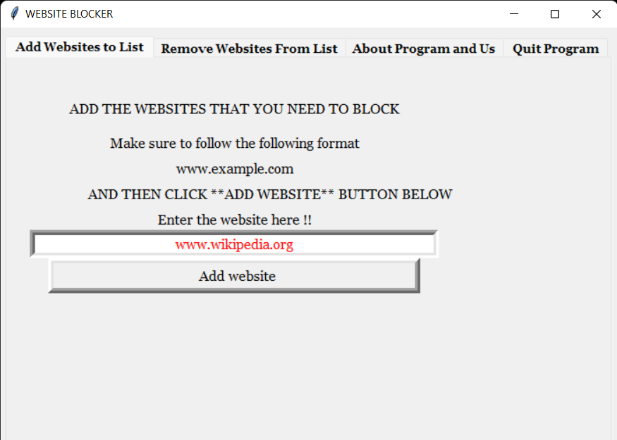
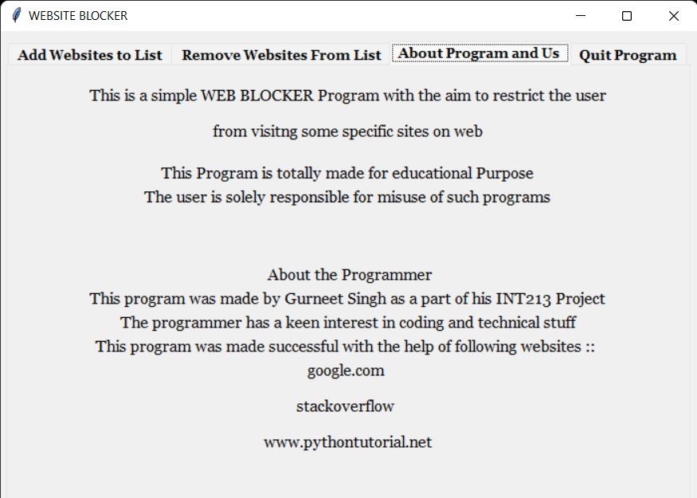
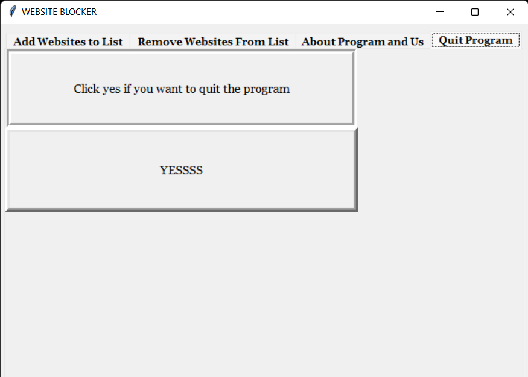

# WebPage Blocker
***
## A Simple Program 


[](https://github.com/Gurneet1928)

This is a python based web blocker that restricts users from accesing particular web pages. 
***
## Features

- Add Webpage -> Add Webpage to the file . This webpage will be blocked for further access.
- Remove Webapge -> Displays the list of all the webpages blocked . User can remove any webpage from that list
- About program and Us -> Displays some info about programmer and program
- Quit Program -> A simple button for exiting the program after all the works.
- It creates a **websitesdb** database that helps to keep the records safe

Python is an interpreted high-level general-purpose programming language. Its design philosophy emphasizes code readability with its use of significant indentation. Its language constructs as well as its object-oriented approach aim to help programmers write clear, logical code for small and large-scale projects.
***
# Program Images




***
## Python Tech used in this  ::

- Tabs
- Frames
- Messagebox
- Tkinter
- Grid
- MySQL

And a lot more , including **PYTHON** itself.
***
## Pre-Requisites
- **MySQL latest version** --> It can be download from here : https://www.mysql.com/downloads/.
- **Python3**
- **MySQL Drivers/Connectors for Python** --> Follow the Below Steps to Install it using **CMD**
     * Open CMD using administrator
     * Run the following Code as it is :
```python -m pip install mysql-connector-python```
***
## Installation and Configuration of MySQL
Before running the software , make sure that **MySQL** is installed and also the connection driver.
Also , make sure the **MySQL Server** is running . To run it :
- Go to run 
- type : ```services.msc```
- Start a service called ```MySQL```

This software requires python to be installed in the system
No further installation process is requried And it is a ***DOWNLOAD-AND-RUN*** Software
***
# Run the Software

This software can be run using 3 different ways :
- **Using CMD** : Open CMD in the directory where the program is placed . Then run the following code ```` WebBlocker.py ````
- **Using .py file** : Just double click open on the ```WebBlocker.py``` file in the folder and the program will open
- **Using .ipynb file** :  Just open the ```WebBlocker.ipynb``` in softwares such as anaconda to run it in the software itself
***
# Usage of Tabs
* ### Add Website to list
  - Type the name in the entry box and click the add button. The webiste should be in the format ```www.example.com``` to be accepted . Otherwise it will be rejected
* ### Remove Websites from List
  - Click on **Refresh**  option before using it everytime.
  - Enter the Sno of website in the entry box and click to remove.
  - Click **Refresh** again to refresh the list
***
## License

MIT

**Free Software, Good Job to me :) :)**
***
